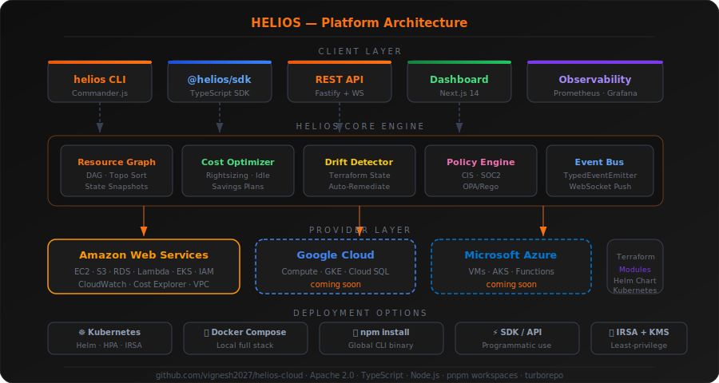

<div align="center">



<br/>

# ☀️ HELIOS

### Enterprise Cloud Infrastructure Orchestration Platform

**Multi-cloud resource inventory · ML cost optimization · Drift detection · Policy compliance**

<br/>

[](https://github.com/vignesh2027/helios-cloud/actions)
[](https://github.com/vignesh2027/helios-cloud/releases)
[](LICENSE)
[](https://www.typescriptlang.org/)
[](https://nodejs.org/)
[](https://pnpm.io/)
[](https://github.com/vignesh2027/helios-cloud/stargazers)

</div>

---

## What is HELIOS?

HELIOS is a **production-grade, open-source cloud infrastructure platform** built for platform engineers and DevOps teams who need a single control plane across AWS, GCP, and Azure.

It combines the power of:
- **Terraform + AWS CDK** — real-time drift detection against your IaC state
- **AWS Cost Explorer** — ML-driven rightsizing and idle resource cleanup
- **AWS Config** — continuous policy evaluation against CIS, SOC 2, PCI DSS
- **AWS Organizations** — multi-account, multi-region aggregation

All delivered as a CLI, SDK, REST API, and web dashboard — open source, self-hosted.

---

## Platform Architecture

<div align="center">

</div>

---

## Features at a Glance

<table>
<tr>
<td width="50%">

**🔭 Universal Resource Inventory**
- Real-time discovery across 50+ AWS resource types
- Dependency graph with topological sort
- Tag compliance enforcement
- Cross-account, multi-region aggregation

**💰 Intelligent Cost Optimization**
- ML-driven rightsizing (EC2, RDS, Lambda)
- Idle resource detection with configurable threshold
- Savings Plans & Reserved Instance analysis
- gp2 → gp3 EBS migration (20% savings)
- 30/60/90-day trend forecasting

</td>
<td width="50%">

**🔍 Infrastructure Drift Detection**
- Continuous comparison vs Terraform state
- Attribute-level diff with severity classification
- Unmanaged resource detection
- Auto-remediation command generation

**🛡️ Policy Enforcement Engine**
- CIS AWS Foundations Benchmark 1.4 / 1.5
- SOC 2, PCI DSS, HIPAA, NIST 800-53
- OPA-compatible Rego policy evaluation
- Real-time violation alerts

</td>
</tr>
</table>

---

## Quick Start

### Install

```bash
# npm
npm install -g @helios-cloud/cli

# pnpm
pnpm add -g @helios-cloud/cli

# Homebrew
brew install helios-cloud/tap/helios
```

### Scan your infrastructure

```bash
# Configure AWS credentials
helios config init

# Discover all resources
helios scan --provider aws --region us-east-1
```

```
  ✓ Scan complete in 3.2s — 847 resources, 2,340 edges

  Resource Summary
  → ec2:instance           214
  → s3:bucket              187
  → lambda:function        143
  → rds:db-instance         42
  → ec2:security-group     261
```

### Optimize costs

```bash
helios optimize --top 5
```

```
  Cost Summary
  ─────────────────────────────────────────
  Total monthly cost:        $24,810
  Potential monthly savings:  $5,412 (21.8%)

  ┌─────────────────────────┬─────────────┬────────────┬──────────┬──────────┐
  │ Resource                │ Action      │ Current    │ Savings  │ Conf.    │
  ├─────────────────────────┼─────────────┼────────────┼──────────┼──────────┤
  │ i-0abc123 (m5.2xlarge)  │ rightsize   │ m5.2xlarge │ $207/mo  │ 97%      │
  │ i-0def456 (idle 31d)    │ terminate   │ m5.xlarge  │ $138/mo  │ 95%      │
  │ db-prod-main            │ rightsize   │ r5.xlarge  │ $259/mo  │ 91%      │
  │ i-0ghi789 (ON_DEMAND)   │ savings-plan│ on-demand  │ $102/mo  │ 90%      │
  │ vol-0abc (unattached)   │ delete      │ 500GB gp2  │  $50/mo  │ 99%      │
  └─────────────────────────┴─────────────┴────────────┴──────────┴──────────┘
```

### Detect drift

```bash
helios drift --state-file ./terraform.tfstate --remediate
```

```
  ⚠  7 drifted resources detected

  Severity breakdown:
  critical 2  │  high 3  │  medium 2  │  low 0

  Remediation Commands:
  $ terraform apply -target=aws_instance.api_server
  $ terraform apply -target=aws_security_group.web_sg
```

### Check policy compliance

```bash
helios policy check --framework cis-aws-1.5
```

```
  CIS AWS Foundations Benchmark v1.5
  ─────────────────────────────────────────────
  ✓ 1.1  Root account MFA enabled
  ✓ 1.2  IAM users have MFA enabled
  ✗ 1.4  Access keys rotated within 90 days     [3 violations]
  ✗ 2.1  CloudTrail enabled in all regions      [2 regions]
  ✓ 3.1  VPC flow logs enabled

  Score: 87/100   Grade: B+
```

---

## Web Dashboard

The HELIOS dashboard ships with two themes — **dark mode** and **warm white** — switchable with one click.

<table>
<tr>
<th align="center">🌙 Dark Mode</th>
<th align="center">☀️ Warm White</th>
</tr>
<tr>
<td align="center">
  <code>Cost charts · Resource inventory · Drift timeline · Policy violations</code>
</td>
<td align="center">
  <code>Same data, warm off-white palette (#FCF8F4) — easy on the eyes</code>
</td>
</tr>
</table>

Launch dashboard:

```bash
# Local development
cd packages/dashboard && pnpm dev
# → http://localhost:3000

# Docker
docker compose up dashboard
```

---

## SDK Usage

```typescript
import { HeliosClient } from '@helios-cloud/sdk';

const helios = new HeliosClient({
  provider: 'aws',
  region: 'us-east-1',
  credentials: { profile: 'default' },
});

// Discover resources
const { total, graph } = await helios.scan();
console.log(`Found ${total} resources`);

// Top cost savings
const recs = await helios.optimizer.getTopSavings(5);
for (const r of recs) {
  console.log(`  ${r.action}: save $${r.monthlySavings.toFixed(0)}/mo — ${r.rationale}`);
}

// Check drift
const drift = await helios.drift.detect('./terraform.tfstate');
if (drift.hasDrift) {
  console.log(`${drift.totalDrifted} drifted resources (${drift.bySeverity.critical} critical)`);
}

// Compliance score
const score = await helios.policy.getScore('cis-aws-1.5');
console.log(`CIS compliance: ${score.toFixed(0)}%`);
```

---

## Kubernetes Deployment

```bash
helm repo add helios https://charts.helios.sh
helm install helios helios/helios \
  --namespace helios-system \
  --create-namespace \
  --set aws.region=us-east-1 \
  --set aws.accountId=123456789012 \
  --set api.replicas=3 \
  --set serviceMonitor.enabled=true
```

### What gets deployed

| Component | Replicas | Resources | Notes |
|-----------|----------|-----------|-------|
| `helios-api` | 2–10 (HPA) | 100m/256Mi → 500m/512Mi | Non-root, readOnlyFS, IMDSv2 |
| `helios-dashboard` | 2 | 50m/128Mi → 200m/256Mi | Next.js standalone |
| NetworkPolicy | — | — | Ingress from ingress-nginx only |
| ServiceMonitor | — | — | Prometheus scrape at /metrics |

---

## Terraform Modules

```hcl
module "vpc" {
  source = "github.com/vignesh2027/helios-cloud//terraform/modules/vpc"

  name         = "production"
  cidr_block   = "10.0.0.0/16"
  cluster_name = "my-eks-cluster"

  public_subnet_cidrs  = ["10.0.1.0/24", "10.0.2.0/24", "10.0.3.0/24"]
  private_subnet_cidrs = ["10.0.11.0/24", "10.0.12.0/24", "10.0.13.0/24"]

  enable_nat_gateway       = true
  enable_flow_logs         = true
  flow_logs_retention_days = 30

  tags = { Environment = "production", Team = "platform" }
}

module "eks" {
  source = "github.com/vignesh2027/helios-cloud//terraform/modules/eks"

  cluster_name        = "production"
  kubernetes_version  = "1.29"
  vpc_id              = module.vpc.vpc_id
  subnet_ids          = concat(module.vpc.public_subnet_ids, module.vpc.private_subnet_ids)
  private_subnet_ids  = module.vpc.private_subnet_ids
  endpoint_private_access = true
  endpoint_public_access  = false

  node_groups = {
    system  = { instance_types = ["m5.large"],  capacity_type = "ON_DEMAND", desired_size = 2, min_size = 2, max_size = 4,  disk_size = 50,  labels = { role = "system"  }, taints = [] }
    workers = { instance_types = ["m5.2xlarge"], capacity_type = "SPOT",     desired_size = 6, min_size = 3, max_size = 50, disk_size = 100, labels = { role = "worker"  }, taints = [] }
  }
}
```

---

## Configuration Reference

```yaml
# helios.yaml
version: "1"

providers:
  aws:
    regions: [us-east-1, us-west-2, eu-west-1]
    accounts:
      - id: "123456789012"
        role: arn:aws:iam::123456789012:role/HeliosReadOnly

scan:
  interval: 5m
  resourceTypes: [ec2:instance, s3:bucket, rds:db-instance, lambda:function, eks:cluster]

optimizer:
  enabled: true
  idleThresholdDays: 14
  rightsizingConfidenceThreshold: 0.85

drift:
  enabled: true
  stateBackend:
    type: s3
    bucket: my-terraform-state
    prefix: helios/

policy:
  frameworks: [cis-aws-1.5, soc2]
  alerting:
    slack:
      webhook: ${SLACK_WEBHOOK_URL}
      channel: "#cloud-alerts"

api:
  port: 8080
  auth: { type: jwt, issuer: https://auth.example.com }
```

---

## Project Structure

```
helios-cloud/
├── packages/
│   ├── core/           # Resource graph, state snapshots, event bus, config
│   ├── cli/            # helios CLI (Commander.js, chalk, ora)
│   ├── sdk/            # @helios-cloud/sdk — public TypeScript API
│   ├── api/            # Fastify REST + WebSocket server
│   ├── optimizer/      # Cost analysis, rightsizing, pricing models
│   ├── drift/          # Terraform state parser, attribute differ
│   ├── dashboard/      # Next.js 14 dashboard (dark + warm-white themes)
│   └── providers/
│       └── aws/        # AWS SDK v3 adapters (EC2, S3, Lambda, RDS, VPC)
├── terraform/
│   ├── modules/vpc/    # Production VPC module
│   ├── modules/eks/    # EKS cluster with managed node groups
│   └── examples/       # Complete reference architectures
├── charts/helios/      # Helm chart with HPA, PDB, NetworkPolicy
├── .github/workflows/  # CI, Release, Security (CodeQL, Trivy, Semgrep)
└── docs/               # Architecture guide, API reference
```

---

## CLI Reference

```
helios [command] [options]

Commands:
  scan         Discover and inventory cloud resources
  optimize     Analyze cost optimization opportunities
  drift        Detect infrastructure drift from Terraform state
  policy       Evaluate policy compliance (CIS, SOC2, PCI, HIPAA)
  config       Manage HELIOS configuration
  version      Show version and build info

Options:
  --config, -c   Path to helios.yaml          [default: ./helios.yaml]
  --output, -o   Output format: table|json|yaml   [default: table]
  --region       Override AWS region
  --profile      AWS credential profile
  --verbose      Enable debug logging
  --no-color     Disable color output
```

---

## Roadmap

| Status | Feature |
|--------|---------|
| ✅ | AWS provider (EC2, S3, RDS, Lambda, EKS, VPC, IAM) |
| ✅ | Cost optimization engine with ML rightsizing |
| ✅ | Terraform state drift detection |
| ✅ | OPA policy engine (CIS AWS 1.5) |
| ✅ | Fastify REST API + WebSocket events |
| ✅ | Next.js dashboard (dark + warm-white themes) |
| ✅ | Kubernetes operator + Helm chart |
| ✅ | Terraform VPC + EKS modules |
| 🚧 | GCP provider (Compute, GKE, Cloud SQL) |
| 🚧 | Azure provider (VMs, AKS, Functions) |
| 📋 | AI-powered anomaly detection (via AWS Bedrock) |
| 📋 | FinOps reporting (FOCUS spec compliance) |
| 📋 | Terraform Cloud / Spacelift integration |
| 📋 | VS Code extension |

---

## Contributing

```bash
git clone https://github.com/vignesh2027/helios-cloud
cd helios-cloud
pnpm install
pnpm build
pnpm test
```

See [CONTRIBUTING.md](CONTRIBUTING.md) for development setup, coding standards, and PR guidelines.

---

## License

Apache 2.0 — see [LICENSE](LICENSE) for details.

---

<div align="center">

Built by [Vigneshwar L](https://github.com/vignesh2027) · CSE '26, Takshashila University

[](https://github.com/vignesh2027)

</div>
